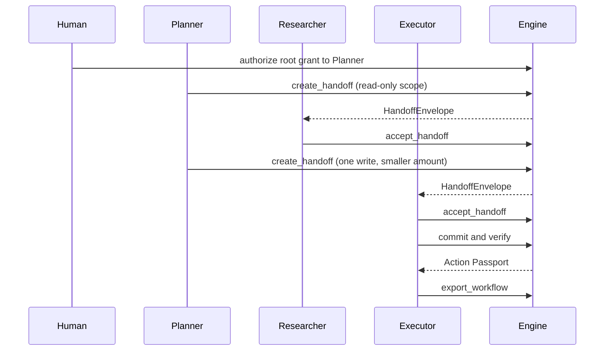

# Multi-agent handoff

Agents do not hand each other a bare tool call. The sender asks the engine
to delegate a narrower grant, and the receiver has to check that envelope
before it does anything. The check fails closed.

An agent still cannot issue a grant. `create_handoff` calls
`engine.delegate`, and `issue_grant` rejects an agent issuer. The human or
service that holds the signing key is the issuer of every hop. The agent
only names who the narrower grant is for.

## What is in an envelope

`HandoffEnvelope` carries:

- `from_agent` and `to_agent`
- a short `task` description
- the delegated `ExecutionGrant`
- `parent_grant_id` and `delegation_depth`
- `lineage`, the grant objects from the workflow root through the child
- `created_at`, `expires_at`
- `content_hash`, a canonical hash of every other field

The hash uses `karmasakshi.canonical`. Changing the task, the grant, or the
lineage without recomputing the hash makes `accept_handoff` reject the
envelope.

## Accept, before any effect

`accept_handoff(engine, envelope, receiving_agent)` does all of the
following. The first failure raises `HandoffRejectedError` and the agent
must not commit.

1. Recompute `content_hash`.
2. Check the envelope has not expired.
3. Check `receiving_agent` is the addressee and the grant subject.
4. `verify_grant` (signature and time window).
5. `verify_delegation_chain` on `lineage`.
6. `assert_no_revoked_ancestors` against the grant store.

A missing lineage row, a revoked grandparent, or a hop past
`MAX_DELEGATION_DEPTH` (16) is a rejection. Widening scope or amount is
rejected earlier, by `engine.delegate`, as `ConstraintWideningError`.

`open_workflow` records the root grant's lineage as "no parent" when that
row is missing. `engine.authorize` does not write that row itself. Without
it, a later ancestor walk cannot tell a root from an unknown parent.

## Workflow record and the evidence pack

`WorkflowRecord` is the in-process list of handoffs plus the Action
Passports and Evidence Packs for effects that actually committed.
`record_effect` calls `build_passport` and `build_evidence_pack`. It does
not invent a second passport format.

`export_workflow` freezes that list into one `WorkflowExport` JSON document.
`verify_workflow_export` checks the export hash, that every handoff names
this workflow and descends from this root grant, and then calls
`verify_evidence_pack` on each embedded pack. A handoff taken from another
workflow fails that check even if you recompute the export hash: its
`workflow_id` or its root grant does not belong here.

Offline verification does not replay the live revocation set. Revocation is
enforced when the receiver calls `accept_handoff`, and again at `commit`.
`karmasakshi workflow verify --revocations FILE` is an extra check a
reviewer opts into. The file is a JSON list of grant ids, or
`{"grant_ids": ["..."]}`. If any grant in a handoff chain is listed, the
export fails. Leaving the flag off keeps the historical verdict: an export
made before a later revocation is still a true record of what was checked
at accept and commit time.

## Shape of a run



The signing key stays with the human or service process. It is not placed
in LangGraph state. See `examples/multi_agent_handoff/run_workflow.py`.

## Run the example

From the repo root, with the LangGraph extra installed:

```bash
pip install -e ".[langgraph]"
python examples/multi_agent_handoff/run_workflow.py
```

The three agents are fixed functions. There is no model call and no API
key. The executor commits one payment through `PaymentSimulatorAdapter`.
The script prints `verified`, `verified_match`, and `evidence_verified: True`.

By default the script also writes the workflow into `./.karmasakshi`
(`--workspace` changes the directory). After it finishes, this works:

```bash
karmasakshi workflow export wf-refund-8842 --workspace .karmasakshi
```

## CLI-only three-agent workflow

The same shape, with no Python script. The human key issues the root
grant. Each hop is `handoff create` (the engine delegates; an agent still
cannot issue). The executor must `handoff accept` before `execute`.
`execute --workflow-id` and `--handoff-id` then commit, verify, and record
the Action Passport and Evidence Pack on the workflow. Omit either flag
and the command behaves as before: commit only, no passport on the workflow.

`execute` fails closed (exit 2) if that handoff was not accepted by its
addressee, belongs to another workflow, or `--grant-id` is not the
delegated grant. It calls `accept_handoff` again, so expiry, signature,
chain, and revocation are still checked at commit time.

`--handoff-id` on `handoff create` picks the id. A second create with the
same id in that workspace is rejected before another grant is delegated.

`grant issue` still leaves scope unrestricted when the new flags are
omitted. `--max-amount-minor`, `--currency`, `--allowed-recipient`
(repeatable), and `--effect-type` (repeatable) map onto the existing
`ScopeConstraints` and `allowed_effect_types`. A later handoff cannot widen
them; that is still `ConstraintWideningError` from `engine.delegate`.

The payment simulator snapshot lives at
`.karmasakshi/payment-simulator.json`, so `verify` in a later process can
see the settled payment. `execute --fund-source-account` credits the
manifest's `source_account`. `--fund-account-id` must be that same account
or the command errors before commit, and the manifest is not left failed.
If `prepare` already stored a balance that matches the sealed fingerprint,
`execute` does not add the amount a second time.

```bash
karmasakshi init
karmasakshi key generate issuer-1

karmasakshi --json prepare \
  --adapter payment \
  --source-account operating \
  --beneficiary priya \
  --amount-minor-units 150000 \
  --currency INR \
  --reference order-8842 \
  --fund-source-account 1000000 \
  --actor-id planner --actor-type agent \
  --principal-id approver-1 --principal-type human \
  --idempotency-key refund-priya-8842
# set MANIFEST to the printed manifest_id

karmasakshi seal "$MANIFEST" --key-id issuer-1

karmasakshi --json grant issue "$MANIFEST" \
  --issuer-id approver-1 \
  --subject-id planner \
  --key-id issuer-1 \
  --audience payment.simulator \
  --max-uses 2 \
  --ttl-seconds 3600 \
  --max-amount-minor 500000 \
  --currency INR \
  --allowed-recipient priya \
  --effect-type payment.read \
  --effect-type payment.transfer
# set ROOT to the printed grant_id

karmasakshi --json handoff create "$ROOT" \
  --to-agent researcher --from-agent planner \
  --task "Read the refund beneficiary and amount. Do not transfer." \
  --issuer-id approver-1 --key-id issuer-1 \
  --workflow-id wf-refund-8842 \
  --handoff-id handoff-researcher \
  --effect-type payment.read \
  --recipient priya \
  --max-amount-minor 0 \
  --max-uses 1

karmasakshi --json handoff create "$ROOT" \
  --to-agent executor --from-agent planner \
  --task "Transfer exactly 150000 INR minor units to priya for order 8842." \
  --issuer-id approver-1 --key-id issuer-1 \
  --workflow-id wf-refund-8842 \
  --handoff-id handoff-executor \
  --effect-type payment.transfer \
  --recipient priya \
  --max-amount-minor 150000 \
  --max-uses 1 \
  --manifest-id "$MANIFEST"
# set EXECUTOR_GRANT to the printed grant_id

karmasakshi handoff accept handoff-researcher --agent-id researcher
karmasakshi handoff accept handoff-executor --agent-id executor

karmasakshi execute "$MANIFEST" \
  --grant-id "$EXECUTOR_GRANT" \
  --adapter payment \
  --fund-source-account 1000000 \
  --workflow-id wf-refund-8842 \
  --handoff-id handoff-executor

karmasakshi workflow export wf-refund-8842
```

That export line is `2 handoff(s), 1 passport(s), 1 evidence pack(s); VERIFIED`.

Check a saved file offline (exit 0, or 2 with the reason):

```bash
karmasakshi workflow export wf-refund-8842 -o workflow.json
karmasakshi workflow verify workflow.json
karmasakshi --json workflow verify workflow.json
karmasakshi workflow verify workflow.json --revocations revoked.json
```

`revoked.json` is `["grant-id"]` or `{"grant_ids": ["grant-id"]}`. The flag
is opt-in for the reason above.

The web console reads this same workspace (`.karmasakshi`, or
`KARMASAKSHI_HOME`). `/console/workflows` and
`/console/workflows/{id}` are read-only: handoff tree (from, to, depth,
scope, accepted or not, hash), passport outcome, and evidence-pack
verification. Tampered or rejected rows use the red badge. There is no
approve, accept, or revoke control on those pages.

```text
karmasakshi handoff create <parent_grant_id> \
  --to-agent ID --task TEXT --issuer-id ID --key-id ID --workflow-id ID \
  [--handoff-id ID]
karmasakshi handoff accept <handoff_id> --agent-id ID
karmasakshi handoff inspect <handoff_id>
karmasakshi workflow export <workflow-id> [-o FILE]
karmasakshi workflow verify <file> [--revocations FILE]
karmasakshi execute <manifest_id> --grant-id ID --adapter payment \
  --workflow-id ID --handoff-id ID
```

`handoff create` opens the workflow when `--workflow-id` is new and the
parent grant is a root. `workflow export` and `workflow verify` both exit 2
if the check fails.
