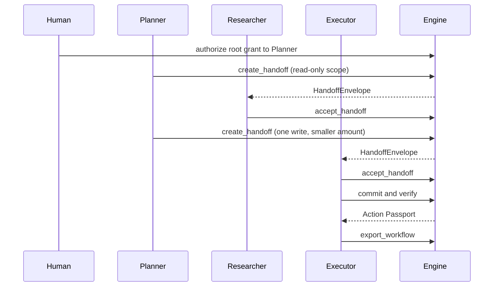

# Multi-agent handoff

Agents do not hand each other a bare tool call. The sender asks the engine
to delegate a narrower grant, and the receiver has to check that envelope
before it does anything. The check fails closed.

An agent still cannot issue a grant. `create_handoff` calls
`engine.delegate`, and `issue_grant` rejects an agent issuer. The human or
service that holds the signing key is the issuer of every hop. The agent
only names who the narrower grant is for.

## What is in an envelope

`HandoffEnvelope` carries:

- `from_agent` and `to_agent`
- a short `task` description
- the delegated `ExecutionGrant`
- `parent_grant_id` and `delegation_depth`
- `lineage`, the grant objects from the workflow root through the child
- `created_at`, `expires_at`
- `content_hash`, a canonical hash of every other field

The hash uses `karmasakshi.canonical`. Changing the task, the grant, or the
lineage without recomputing the hash makes `accept_handoff` reject the
envelope.

## Accept, before any effect

`accept_handoff(engine, envelope, receiving_agent)` does all of the
following. The first failure raises `HandoffRejectedError` and the agent
must not commit.

1. Recompute `content_hash`.
2. Check the envelope has not expired.
3. Check `receiving_agent` is the addressee and the grant subject.
4. `verify_grant` (signature and time window).
5. `verify_delegation_chain` on `lineage`.
6. `assert_no_revoked_ancestors` against the grant store.

A missing lineage row, a revoked grandparent, or a hop past
`MAX_DELEGATION_DEPTH` (16) is a rejection. Widening scope or amount is
rejected earlier, by `engine.delegate`, as `ConstraintWideningError`.

`open_workflow` records the root grant's lineage as "no parent" when that
row is missing. `engine.authorize` does not write that row itself. Without
it, a later ancestor walk cannot tell a root from an unknown parent.

## Workflow record and the evidence pack

`WorkflowRecord` is the in-process list of handoffs plus the Action
Passports and Evidence Packs for effects that actually committed.
`record_effect` calls `build_passport` and `build_evidence_pack`. It does
not invent a second passport format.

`export_workflow` freezes that list into one `WorkflowExport` JSON document.
`verify_workflow_export` checks the export hash, that every handoff names
this workflow and descends from this root grant, and then calls
`verify_evidence_pack` on each embedded pack. A handoff taken from another
workflow fails that check even if you recompute the export hash: its
`workflow_id` or its root grant does not belong here.

Offline verification does not replay the live revocation set. Revocation is
enforced when the receiver calls `accept_handoff`, and again at `commit`.

## Shape of a run



The signing key stays with the human or service process. It is not placed
in LangGraph state. See `examples/multi_agent_handoff/run_workflow.py`.

## Run the example

From the repo root, with the LangGraph extra installed:

```bash
pip install -e ".[langgraph]"
python examples/multi_agent_handoff/run_workflow.py
```

The three agents are fixed functions. There is no model call and no API
key. The executor commits one payment through `PaymentSimulatorAdapter`.
The script prints `verified`, `verified_match`, and `evidence_verified: True`.

## CLI

```text
karmasakshi handoff create <parent_grant_id> \
  --to-agent ID --task TEXT --issuer-id ID --key-id ID --workflow-id ID
karmasakshi handoff accept <handoff_id> --agent-id ID
karmasakshi handoff inspect <handoff_id>
karmasakshi workflow export <workflow-id> [-o FILE]
```

`handoff create` opens the workflow when `--workflow-id` is new and the
parent grant is a root. `workflow export` verifies the file it writes and
exits 2 if that check fails.
